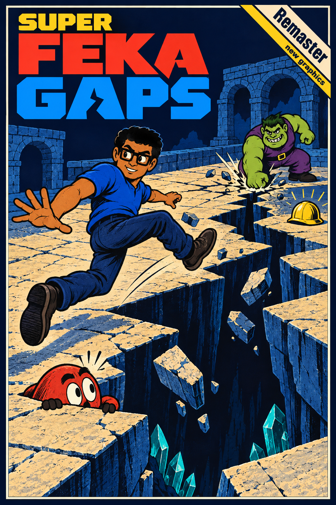

# Super Feka Gaps

<a href="public/assets/branding/super-feka-gaps-remaster-cover-abismo.png"></a>

[Português](#português) · [English](#english)

## Português

Jogo de plataforma 2D em TypeScript, com engine própria, Canvas, Web Audio e editor de mundos no navegador. O jogo usa física com passo fixo de 60 Hz, pixel art, fases em tiles, inimigos, checkpoints, coletáveis e áudio procedural e gravado. Não há dependências de runtime.

**Jogue online:** [superfekagaps.torbware.space](https://superfekagaps.torbware.space/). Ao concluir a aventura com um novo recorde pessoal, você pode escolher um nome e publicar sua pontuação no [placar global](docs/scoreboard.md).

**Super Feka Gaps World:** a versão local abre a sequência com seis mundos, 30 fases, novos chefes, mapa, progresso salvo e assets próprios. Veja o [estado da implementação](docs/world/implementacao.md), a [galeria de produção](docs/world/capturas/index.html) e o [documento de direção](docs/world/README.md). Use `?classic=true` para jogar o remaster original e `?worldEditor=true` para editar fases World. O endereço online acima não foi atualizado por esta implementação.

**Expansão — Império da Delícia:** abra `delicia.html`, `?delicia=true` ou o acesso no mapa World. A nova ilha tem 12 fases, dois santuários opcionais, Jajá e Paulo Guina com três fases de combate, 20 memórias, arte gerada, modelo Blender e áudio original ElevenLabs. [Como jogar, história, assets e verificações](docs/world/delicia/README.md). A [segunda produção](docs/world/delicia/entrega-v2.md) redesenha a exploração em 48 setores e acrescenta máquinas, oito famílias de inimigos, novas animações e medalhas. O [modelo da ilha foi reconstruído](docs/world/delicia/modelo-v3.md), com arquitetura detalhada, relevo contínuo e nova projeção dos destinos.

### Rodar o projeto

Use uma versão do Node.js que atenda ao campo `engines` de [package.json](package.json).

```sh
npm ci
npm run dev
```

O Vite informa a URL local no terminal, normalmente `http://localhost:3000`. Abra essa URL para jogar; acrescente `?editor=true` para abrir o editor de mundos.

| Comando | Finalidade |
| --- | --- |
| `npm run dev` | Servidor local com recarregamento |
| `npm test` | Testes de regressão |
| `npm run check` | Executa testes, validações, typecheck e build |
| `npm run validate` | Valida fases e matrizes de sprites |
| `npm run typecheck` | Verificação estática de TypeScript |
| `npm run build` | Executa validação e typecheck, depois gera `dist/` |
| `npm run size:build` | Confere o orçamento do pacote já gerado e lista os maiores arquivos |
| `npm run preview` | Serve o build de `dist/` para revisão local |

O [critério do pacote de publicação](docs/build-output.md) preserva os originais
e omite apenas referências de revisão que não são usadas pelas entradas publicadas.

### Editor de mundos

1. Abra `http://localhost:3000/?editor=true` usando a porta indicada pelo Vite.
2. Selecione uma fase da lista, importe um arquivo `.ts`/`.json` ou clique em **Nova fase**. A aba Levels permite editar ID, nome, tempo e tipo de fase.
3. Use a paleta para pintar terrenos e posicionar moedas, itens, checkpoints, objetivo e inimigos. A aba de lógica contém regiões de áudio, câmera, dano e diálogo; o inspetor edita as propriedades dos objetos selecionados.
4. Ajuste largura e altura pelos campos de limites. Com a ferramenta de seleção, arraste as bordas para redimensionar. `Fit to Content` ajusta a grade ao conteúdo; o histórico permite desfazer alterações.
5. Salve o resultado. Sem uma pasta conectada, o editor baixa o nível como TypeScript. Para gravar diretamente no projeto, use `Abrir pasta` e escolha **`src/data/levels`**. Uma fase nova é criada com um nome de arquivo derivado do ID; uma fase existente deve ser aberta da lista antes de ser sobrescrita.

O acesso direto a pastas depende da File System Access API em um navegador compatível, como Chrome ou Edge, em `localhost` ou HTTPS. Importação e download permitem trabalhar sem conectar uma pasta. O editor exibe erros de leitura e validação; arquivos importados não executam JavaScript.

No inspetor de regiões, `Ativo` habilita a zona e `Uma vez` limita sua ativação à primeira visita da sessão. Regiões de áudio usam as faixas do catálogo; `STOP` interrompe a música até outra região ou transição de estado. Regiões de diálogo exibem o texto em um balão. Regiões desativadas continuam visíveis na aba de lógica para edição.

Se um arquivo for alterado fora do editor, o salvamento é interrompido para evitar sobrescrever a mudança. Use `Exportar cópia` para guardar seu trabalho antes de reabrir o arquivo. Ao trocar de pasta, selecione novamente o arquivo antes de salvar diretamente nela.

| Ação no editor | Atalho / gesto |
| --- | --- |
| Pincel / borracha / seleção / retângulo / mão | `B` / `E` / `S` / `R` / `H` |
| Enquadrar o mapa | `F` |
| Desfazer | `Ctrl+Z` ou `Cmd+Z` |
| Refazer | `Ctrl+Shift+Z`, `Cmd+Shift+Z` ou `Ctrl+Y` |
| Salvar | `Ctrl+S` ou `Cmd+S` |
| Remover objeto selecionado | `Delete` / `Backspace` |
| Mover a câmera | Arrastar com a mão, botão direito ou botão do meio |
| Zoom | Roda do mouse |
| Posicionar entidades sem encaixe na grade | Segurar `Ctrl` |

As alterações ficam em memória até salvar. Ao adicionar uma nova fase ao jogo, registre o arquivo e sua posição em `CAMPAIGN_LEVELS` em [src/data/levels/index.ts](src/data/levels/index.ts). A ordem dessa lista define a campanha; cada fase deve ter um `id` único. Salvar ou importar um arquivo no editor não altera a ordem da campanha automaticamente.

### Estrutura e convenções

A direção visual usa uma paleta compartilhada, sprites na resolução nativa, materiais conectados aos tiles vizinhos e tipografia bitmap com acentos. Veja a [galeria antes/depois](docs/graphics-v2/index.html) e o [guia de arte e renderização](docs/graphics-v2/README.md). Com o Vite aberto, a galeria fica em `/docs/graphics-v2/index.html`.

| Caminho | Responsabilidade |
| --- | --- |
| `src/main.ts` | Inicialização |
| `src/game/` | Estados, progressão, pontuação e coordenação do jogo |
| `src/engine/` | Renderização, entrada, áudio e fundos |
| `src/graphics/` | Paleta, atlas de sprites, materiais, fundos, fonte bitmap e interface |
| `src/world/Level.ts` | Tilemap, colisões e tiles dinâmicos |
| `src/world/levelValidation.ts` | Validação de dados compartilhada pelo editor e scripts |
| `src/editor/` | Interface, arquivos, serialização, geometria e histórico do editor |
| `src/data/levels/` | Um módulo `DATA: LevelData` por fase e índice da campanha |
| `src/entities/` | Jogador e inimigos |
| `src/assets/` | Especificações de pixel art e referências visuais |
| `src/voice/` | Falas e balões de diálogo |
| `public/` | Sprites, áudio, ícones e outros arquivos servidos diretamente |
| `scripts/` | Validação e manutenção de conteúdo em TypeScript |
| `tests/` | Regressões automatizadas executadas com `node:test` e `tsx` |
| `tools/` | Utilitários Python opcionais |

`width` e `height` contam tiles de **16 pixels**. `tiles[row][column]` usa índices locais à matriz; a posição no mundo é `(índice + originX/originY) × 16`. A origem é opcional e pode ser negativa. Spawn, objetivo, checkpoints, inimigos e coletáveis usam **coordenadas de tiles no mundo**; regiões de lógica usam **pixels no mundo**. As definições estão em [src/types.ts](src/types.ts) e [src/constants.ts](src/constants.ts).

Antes de entregar alterações, rode:

```sh
npm test
npm run build
```

Ou use `npm run check` para executar a sequência completa. A checagem de tipos inclui o jogo, os scripts, os testes e a configuração do Vite.

O validador confere formato, tipos de tiles e objetos, dimensões, IDs únicos e posições considerando a origem do mapa. O editor preserva objetos ao reduzir a grade; ajuste objetos que ficaram fora dela antes de incorporar a fase à campanha.

### Subsolo de WORLD 1-1

A primeira fase agora oferece uma rota subterrânea opcional. A trilha de moedas sinaliza a entrada em x11–13; plataformas de pedra, uma ponte instável e cristais conduzem ao checkpoint inferior. Há saídas intermediárias por molas e uma saída final em x68–69. O desvio inclui uma recompensa e uma travessia curta de lava, com espaço para recuperar uma queda.

O editor mostra a prévia do fundo por padrão. Na aba **Theme**, ative **Fundo subterrâneo**, escolha a linha de transição em coordenadas do mundo e ajuste gradiente, camadas e paralaxe. Os tipos `cavern` e `crystals` também podem ser usados em outras fases. A paleta **Rocha** é sólida, **Saliente** é atravessável por baixo e **Cristal** é decorativo. O fundo é gerado de modo determinístico e repetido sem mudar de desenho a cada carregamento.

Para conferir grades de arquivos de fase sem modificá-los:

```sh
npx tsx scripts/normalize_tiles.ts --check
```

O mesmo comando **sem `--check`** ajusta a quantidade de linhas e colunas a `height`/`width`, completando com ar ou cortando excedentes. Revise o diff: a operação remove tiles além das dimensões declaradas. Os demais campos do arquivo são preservados.

Ferramentas opcionais: `python tools/scanner.py` cria uma visão textual do projeto; `tools/clean_sprite.py` trata fundos de sprites e requer Pillow e NumPy. Elas não participam do build do jogo.

### Controles do jogo

| Ação | Teclas |
| --- | --- |
| Mover | `A` / `D` ou setas esquerda/direita |
| Pular | `W`, Espaço, `Z` ou seta para cima |
| Correr | Shift, `X` |
| Ataque para baixo no ar | `S` ou seta para baixo |
| Iniciar / confirmar | Enter |
| Pausar | Esc |
| Ativar / desativar som | `M` |

No toque, use as setas para andar, **X** para correr, **↑** para pular e **↓** no ar para a sentada. Toque no topo para pausar; nos menus, toque para confirmar. O golpe que abre buracos do Joãozão sinaliza e fixa a área antes do impacto: sair da faixa evita o buraco, e acertar o chefe durante a preparação interrompe o ataque. Licença: MIT.

## English

**Play online:** [superfekagaps.torbware.space](https://superfekagaps.torbware.space/). After a personal-best finish, you can choose a name and opt in to the [global leaderboard](docs/scoreboard.md).

Super Feka Gaps is a TypeScript 2D platformer with a custom Canvas/Web Audio engine and an in-browser world editor. It has a fixed 60 Hz physics step, tile-based levels, collectibles, checkpoints, enemies and procedural/recorded audio, with no runtime dependencies.

### Development

Use Node.js matching `package.json`'s `engines`, then run `npm ci` and `npm run dev`. Open the URL printed by Vite (normally `http://localhost:3000`). Add `?editor=true` to open the world editor. Run `npm test` and `npm run build` before submitting changes; the build also runs level/sprite validation and TypeScript checks.

The editor opens bundled levels, creates new levels, imports `.ts`/`.json` files, and downloads saved TypeScript files. The Levels tab edits the ID, name, time limit, and boss flag. To save directly into the repository, use **Abrir pasta** (Open folder) and select **`src/data/levels`**. New levels create a file named from the ID; existing files must first be opened from the folder list. Direct folder access requires a browser supporting the File System Access API on localhost or HTTPS. Changes remain in memory until saved.

Editor tools use **B/E/S/R/H** (brush, eraser, selection, rectangle, hand); **F** frames the map. Undo with **Ctrl/Cmd+Z**, redo with **Ctrl/Cmd+Shift+Z** or **Ctrl+Y**, and save with **Ctrl/Cmd+S**. Pan with the hand, right mouse button or middle button; use the wheel to zoom. Hold **Ctrl** for free entity placement. Select objects to edit their properties and use **Delete/Backspace** to remove them.

### Content and architecture

Levels live in **`src/data/levels/`**, with one exported `DATA: LevelData` object per file. Add each campaign file to `CAMPAIGN_LEVELS` in `src/data/levels/index.ts`: its order defines the campaign, and level IDs must be unique. Importing/saving a file in the editor does not register it in the campaign.

The main modules are `src/game/` (orchestration), `src/engine/` (rendering/input/audio), `src/world/` (collision and shared validation), `src/entities/`, `src/voice/` and `src/editor/` (UI, geometry, history and serialization). Static files live in `public/`; validation/maintenance commands live in `scripts/`, regression tests in `tests/`, and optional Python utilities in `tools/`.

Dimensions and entity/spawn/checkpoint/goal positions use **16-pixel world tiles**. Terrain lives in `tiles`; coins, items, checkpoints and the goal live in their respective `LevelData` fields. Tile arrays use local indices plus optional `originX`/`originY`, which may be negative. Trigger rectangles use **world pixels**. See `src/types.ts` and `src/constants.ts` for the schema. Resizing preserves objects; adjust any objects outside the grid before adding a level to the campaign.

`npx tsx scripts/normalize_tiles.ts --check` checks source grid dimensions without writing. Omit `--check` to pad missing rows/cells with air or trim excess tiles to the declared dimensions, preserving other level fields. Review the resulting diff.

Game controls: **A/D or Left/Right** move, **W/Space/Z/Up** jump, **Shift/X** run, **S/Down** ground pound in the air, **Enter** confirm, **Esc** pause, **M** mute. The latest horizontal key pressed takes priority until released. Touch controls are also available. License: MIT.
