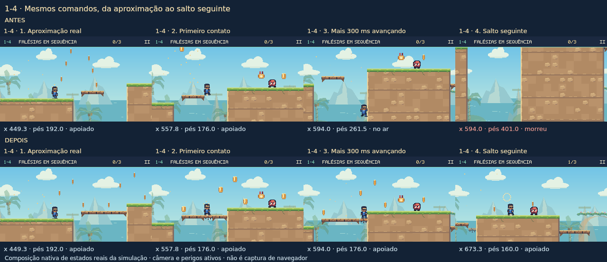
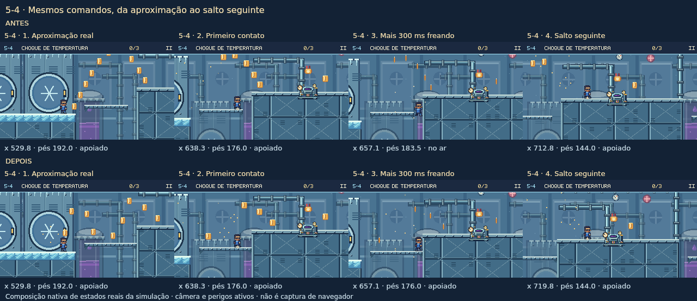

# Natural coin approaches and usable landing shelves

## What was wrong with the first correction

The previous calibration proved that a player placed at a selected launch point could collect the chosen arc. It did not establish that a player arriving from the preceding gameplay route would naturally make that jump or have a usable landing. In particular:

- The first 1-4 ribbon rewarded a running 9-frame hold with 7/8 coins but only 2.2 px support on the far end of a 48 px shelf. Neutral braking left support in one frame; delaying the next jump 100 ms could kill the player.
- The first 5-4 ascent encouraged skipping an intermediate shelf with a maximum held jump. Ordinary running hops landed on that shelf, then stopping drift carried the player through a 16 px gap into the higher wall.
- Seven groups hovered above naturally descending stepping-stone routes. Ordinary walking/running used the real route but collected only 2–4 of 10–11 guide coins.
- One 6-4 coin was permanently obscured by the 23 px HUD, and other high arcs became obscured at the actual takeoff camera.

This correction addresses the approaches, stable support, onward movement and visible guidance together. No player physics, collision envelopes, enemy placements or machine mechanics change.

## Changes

- Reposition 203 existing coins in 24 ordinary guide groups across 13 courses. The 9-coin 2-3 secret-shuttle ride remains byte-identical.
- Use the existing intermediate surfaces: ordinary moderate hops, two separate upward hops where needed, and seven descending walking/running trails. No blanket maximum-height jump template remains in the ordinary guides.
- Space the coins by actual distance along the native incoming route. Most jump-ribbon gaps are 28–43 px and descending gaps 18–31 px; the long two-hop 1-4 sequence has a maximum 66.6 px gap. No pair in a guide is closer than 18 px.
- Add exactly five tiles, all on existing shelves:

| Stage | Added columns / row | Type | Purpose |
| --- | --- | --- | --- |
| 1-4 | 35–37 /11 | Falling platform | Extend the intermediate shelf to the 16 px higher cliff; retain collapse/reset behavior. |
| 5-1 | 122 /11 | One-way platform | Close the 16 px floor gap at the 32 px higher wall. |
| 5-4 | 41 /11 | One-way platform | Close the equivalent braking trap without removing the next upward jump. |

The shelf donor is 65c2d87. All original pickup IDs, kinds, ordering and counts stay unchanged. The reviewed finish rewards, lower-beach seal trail, secrets, carriers, first-charger placement, 4-3/4-4 return ledges, saves and equipment remain untouched.

## Independent acceptance, using controls not chosen for these coins

An independent native WorldGame replay loaded the candidate's authored data into the unchanged 9b73e115 engine. The main sweep reused 254 previously fixed approaches with two responses each: neutral braking or continued input for 18 fixed steps (300 ms), followed by an ordinary 9-frame hop. A separate 5-1 sweep translated the frozen 5-4 controls by 1296 px and started at checkpoint index 1. That added 360 cases per version and was explicitly identified as a later extension of the independent grid.

### Running support after 300 ms

| Route | Brake: before → after | Continue: before → after |
| --- | ---: | ---: |
| 1-4 intermediate shelf | 5/16 →16/16 | 3/16 →16/16 |
| 5-4 ice-roof shelf | 54/90 →90/90 | 30/90 →90/90 |
| 5-1 checkpoint ascent shelf | 54/90 →90/90 | 30/90 →90/90 |

### Reaching the next upper bank after that response and hop

| Route | Brake then hop | Continue then hop |
| --- | ---: | ---: |
| 1-4 | 2/16 →13/16 | 2/16 →15/16 |
| 5-4 | 52/90 →82/90 | 34/90 →88/90 |
| 5-1 | 57/90 →87/90 | 36/90 →90/90 |

Stable support is not represented as universal onward success. Some remaining trials already reached the upper bank on their first long jump, then the extra scripted hop met the existing later minion/jet or bounced beyond the named bank. Some braked walking trials safely landed farther along the enlarged shelf and needed to walk closer before the upward hop.

### Coin collection after ordinary onward movement

Final equal-distance coin table, same controls before/after:

| Route / group | Walking mean | Running mean |
| --- | ---: | ---: |
| 1-1 first gap /7 | 6.67 →7.00 | 4.33 →5.22 |
| 1-2 first bridge /6 | 5.25 →5.92 | 4.42 →5.25 |
| 1-4 two-step route /8 | 4.94 →5.94 | 4.81 →5.38 |
| 5-4 two-step ascent /10 | 6.63 →7.50 | 5.87 →7.03 |
| 5-1 two-step ascent /11 | 7.20 →8.67 | 6.37 →7.33 |

Not every response must collect every coin. Braking and immediately jumping again can leave different coins behind when the guide spans two hops. For example,1-4 walking/brake mean 5.25→4.69 and 5-4 walking/brake 7.23→6.37 while support becomes safer. A single 203/203 reference-path result is not the acceptance criterion.

All independently checked first-guide HUD occlusions in 1-1,1-2,1-4 and 5-4 are removed under the native camera and actual opaque sprite rows. The permanently hidden 6-4 coin is gone, and the optional 3-2 ribbon remains visible below the HUD.

## Native replay compositions

These strips use the exact independent replay state, actual camera, foes, objects and falling tiles at four moments: approach, first contact, another 300 ms, and the next ordinary hop. Rendering was checked not to mutate simulation. They are native game compositions, not browser screenshots or a complete-stage playthrough.

The shown 1-4 running/9-frame-hold case falls and dies after the old far-edge landing; the extended falling shelf supports the same continuation and the following jump.

The shown 5-4 baseline can still rescue itself using a late coyote jump. The improvement is stable grounded braking and a deliberate next jump, not a falsely claimed baseline death.

## Full approach audit inventory

The 24 native route definitions use actual spawn/checkpoint entry or an explicitly named preceding surface. A surface entry is not presented as a full-stage replay. Foes, barrels, jets, conveyors, falling tiles, pickup ordering and camera update remain active. References cannot consume a helmet to stand in for avoiding damage.

The additional systematic audit tries 36 variants for each jump route (walk/run, three nearby takeoffs, holds 3/6/9/12/15/full), or six speed/phase cases for descending routes. Totals and collection below are over those bounded controls, not a proof that other routes are impossible. The collection range is among safe onward traversals only.

| Stage / first coin | Intended route | Safe trials before → after | Mean collection before → after | New range |
| --- | --- | ---: | ---: | ---: |
| 1-1:c 4 | First gap from the real opening approach | 30/36 → 30/36 | 3.67 → 5.13 /7 | 4–7 |
| 1-2:c 4 | First bridge from spawn | 32/36 → 32/36 | 4.53 → 5.03 /6 | 4–6 |
| 1-2:c 10 | Second bridge after its patrol | 32/36 → 32/36 | 4.44 → 4.91 /6 | 3–6 |
| 1-2:c 16 | Rising bridge crossing | 20/36 → 20/36 | 5.90 → 6.60 /7 | 5–7 |
| 1-3:c 4 | Upper-route entrance from spawn | 29/36 → 29/36 | 4.10 → 6.21 /7 | 5–7 |
| 1-3:c 11 | Upper-route return from checkpoint | 19/36 → 19/36 | 5.21 → 6.11 /7 | 4–7 |
| 1-4:c 4 | Two usable cliff steps | 0/36 → 32/36 | 0.00 → 6.81 /8 | 5–8 |
| 2-1:c 4 | Cargo stepping stone and onward hop | 36/36 → 36/36 | 3.56 → 8.28 /10 | 6–10 |
| 2-4:c 14 | Dispatch stepping-stone descent | 6/6 → 6/6 | 2.50 → 10.00 /10 | 10–10 |
| 3-2:c 0 | Readable optional maintenance hop | 27/36 → 27/36 | 3.59 → 4.37 /5 | 3–5 |
| 3-4:c 4 | First pressure-room descent | 6/6 → 6/6 | 3.00 → 10.00 /10 | 10–10 |
| 3-4:c 14 | Second pressure-room descent | 6/6 → 6/6 | 3.00 → 10.00 /10 | 10–10 |
| 5-1:c 4 | Cold-stock descent | 6/6 → 6/6 | 3.00 → 10.00 /10 | 10–10 |
| 5-1:c 14 | Two-step cold-stock ascent | 32/36 → 34/36 | 6.69 → 9.56 /11 | 7–11 |
| 5-4:c 4 | Two-step ice-roof ascent | 33/36 → 35/36 | 5.97 → 8.86 /10 | 6–10 |
| 5-4:c 14 | Ice-roof descent | 6/6 → 6/6 | 3.00 → 10.00 /10 | 10–10 |
| 6-4:c 4 | Final high descent after the charger | 3/6 → 3/6 | 4.00 → 11.00 /11 | 11–11 |
| 6-4:c 15 | Final bridge descent after the patrol | 6/6 → 6/6 | 3.00 → 10.00 /10 | 10–10 |
| 1-1:c 19 | Lighthouse gap from the last checkpoint | 34/36 → 34/36 | 3.18 → 4.59 /6 | 3–6 |
| 1-4:c 12 | Long cliff stepping-stone sequence | 36/36 → 36/36 | 5.22 → 7.28 /9 | 6–9 |
| 2-3:c 4 | Container departure with real incoming momentum | 36/36 → 36/36 | 3.28 → 5.03 /7 | 3–7 |
| 2-4:c 4 | Cargo descent after the charger | 16/36 → 16/36 | 6.25 → 8.19 /10 | 4–10 |
| 3-1:c 4 | Receiving-belt departure from spawn | 18/36 → 18/36 | 4.44 → 5.50 /7 | 3–7 |
| 3-1:c 11 | Tank departure from the checkpoint | 16/36 → 16/36 | 6.06 → 7.56 /9 | 5–9 |

The zero baseline for the selected 1-4 two-hop continuation means the fixed onward jump at x576 was beyond the old shelf. It does not mean every old 1-4 route was impossible; the independent response grid above gives the broader comparison.

## Intent and remaining limits

- The upper 1-3 route and 3-2 maintenance catwalk remain optional. The separate 1-1 beach/seal trail is exact, and the 2-3 secret ride is unchanged.
- The first coast gap's running arrival can still require responding to the visible minion. Immediate braking was safe 9/9; blindly continuing 300 ms ran into that enemy in most trials, unchanged by this candidate. This is retained as combat rather than claimed to be a support failure fixed here.
- Some shorter walking jumps still use lower recovery routes or miss a higher intended bank. Running against a factory conveyor and timing a jet opening remain meaningful challenges.
- Waiting on the upper 6-4 roof while its charger commits is unsafe in some phase cases. The new descending trail does not claim to remove that encounter.
- Every jump group has a verified 16 px takeoff corridor with at least two adjacent ordinary hold lengths. The three extended-shelf routes additionally pass 108 combined speed/launch/hold/300 ms-response variants and still require their deliberate second upward jump.
- This is native-engine and authored-data validation. It is not a full-campaign, browser, touch, gamepad or frame-rate QA pass. Native-render sampled replay compositions supplement the audit; they are not browser screenshots.

## Regression and identity guarantees

Focused command:

`node --import tsx --test tests/campaign-natural-coin-approaches.test.ts tests/campaign-jump-coins.test.ts tests/world-opening-route.test.ts`

Result: 61 tests pass, including full native approaches, pickup collection, spacing, actual opaque-sprite visibility, takeoff/hold corridors, both-speed descending trails,300 ms responses, required onward hops, falling-platform timing and original lower-beach recovery. Adding the existing finish-reward regression suite gives 110/110 focused tests. `tsc -p tsconfig.tools.json --noEmit` passes.

The baseline stage hashes reconstruct all 30 stages from 9b73e115 after reverting only the five listed tile additions and 203 reviewed coin coordinates. This checks every unrelated authored field, not merely coin totals. Both historical pickup fixtures are retained. A later integration with unrelated approved stage edits must account for those upstream changes while retaining this original baseline provenance.

Integration on `3ff616053a9d956cd37b2ced086b1d3fba8e75e3` preserves the separately reviewed salon/development release. Its only additional authored-stage delta is the two 3-3 salon comments introduced by `68347c4c80b8d87d0360fe13b80d93ed81289554`. The preservation regression checks those two complete dialogue records explicitly before reconstructing the historical 9b73 hashes; the original fixture remains byte-identical. No other stage field is exempted.

Reproduce the systematic audit: `node --import tsx scripts/audit_natural_guides.ts`.
Regenerate reviewed placements: `node --import tsx scripts/generate_natural_guides.ts --write`.
The older `scripts/audit_jump_coins.ts` entry point forwards to this generator so it cannot accidentally restore the superseded maximum-jump ribbons.

Independent reviewed source identity:

- Base: 9b73e11593bf8bb56b1820d4da18265f19c36578
- campaign.ts SHA-256: ddc70d48bb55946900efa7eaf0c23755b6eb14ddbb1186df8173128627dfdde2
- campaignJumpCoins.ts SHA-256: 47e0136675520873a3318eb88d54b0fd45a439e1fe6b856b4e9d6e701d118ce9
