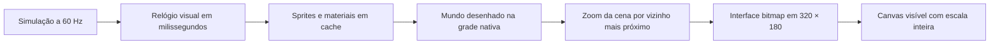

# Gráficos de produção · Super Feka Gaps

[Abrir galeria](index.html) · [Atlas nativo](sprites-native.png) · [Coordenadas dos frames](sprites-native.json) · [Verificação no navegador](verification.json)

A galeria compara capturas da auditoria com o jogo implementado e permite observar as animações. Sirva pelo Vite e abra `/docs/graphics-v2/index.html`. As imagens vêm do renderizador real, sem pintura posterior. Os cenários de comparação têm câmera e posições preparadas para revisão; a verificação também joga com teclado e toque no loop normal.

## Direção visual

Feka mantém cabelo escuro, óculos, pele morena e roupa azul. Os minions vermelhos têm olhos e passos legíveis. Joãozão tem pele verde, roupa roxa, preparação, impacto, disparo e reação ao dano. Yasmin usa um sprite da mesma família visual na tela final.

A luz principal vem de cima e da esquerda. Contornos dos atores usam índigo escuro; materiais têm bordas claras de contato, sombras interiores e grupos pequenos de pixels. O fundo usa contraste menor para deixar caminhos, perigos e personagens em primeiro plano.

| Ambiente | Identidade |
| --- | --- |
| Bosque (`meadow`) | Céu verde-azulado, montanhas suaves, árvores, grama e terra quente |
| Caverna | Rocha azul, camadas de pedra, cristais turquesa; separação clara entre plataformas e parede distante |
| Vale (`ember`) | Céu de fim de tarde, montanhas dessaturadas, terra avermelhada e lava dourada |
| Fortaleza (`citadel`) | Céu violeta, torres e arcos, chão de pedra azul; chefe verde/roxo em destaque |

## Renderização



- `src/graphics/palette.ts`: rampas compartilhadas e hash estável de coordenadas.
- `pixels.ts`: superfície de autoria `PixelGrid`, atlas por frame/paleta/direção/tinta e relógio controlado pela simulação.
- `src/assets/playerSpriteSpec.ts`: Feka em 16 × 26 pixels; hitbox preservada em 14 × 24. Seis poses de caminhada, salto, queda, preparação, sentada, aterrissagem, dano, celebração e piscar. Capacete em 16 × 8.
- `sprites.ts`: minion em 18 × 20, Joãozão em 40 × 48, Yasmin em 20 × 30, moedas e lata em 16 × 16, projéteis em 10 × 10. O atlas de revisão contém 42 entradas, incluindo poses repetidas dos ciclos.
- `TilePainter.ts`: conexão com vizinhos, 16 variantes de textura por coordenada, superfícies identificáveis e cache limitado a 2.048 combinações. Lava e cristais usam quadros discretos; a lava respeita o recuo de quatro pixels usado na colisão.
- `BackgroundScene.ts` e `BackgroundGenerator.ts`: camadas nativas determinísticas, repetição horizontal, paralaxe e recorte por região subterrânea. Alterar uma cor preserva o desenho. Silhuetas sólidas continuam abaixo da imagem quando a câmera desce.
- `BitmapFont.ts` e `GameUI.ts`: letras bitmap com acentos, menus, HUD, controles de toque, resultados e balões.
- `Renderer.ts`: coordena as etapas e conserva a API usada pelo editor. Não carrega o antigo bitmap grande de Yasmin e não avança animações durante o desenho.

O mundo é desenhado sem escala em um buffer próprio. Só depois ele é redimensionado para a composição lógica de 320 × 180, antes do HUD. Isso evita novas cores nas bordas em zoom fracionário. O zoom de câmera é limitado a 0,1–8 para limitar a alocação do buffer; o zoom de navegação do editor é independente. A apresentação desativa interpolação e mantém um número inteiro de pixels físicos no buffer por pixel lógico. Em escalas fracionárias do sistema operacional, a distribuição dos pixels CSS pode variar.

## Animação e resposta do jogo

As durações são em milissegundos. O relógio visual avança no update e fica parado durante a pausa. Chuva, bandeiras, materiais e efeitos não mudam por chamar `render()` novamente. Caminhada normal e corrida têm cadências diferentes; aterrissagem usa uma pose curta sem alterar a colisão. A sentada tem preparação, queda, linhas de movimento e impacto. Molas, aterrissagens e golpes recebem efeitos de contato.

O golpe de buraco do chefe marca três tiles durante 500 ms e fixa o alvo na preparação. O jogador pode sair da área; o buraco permanece no ponto anunciado. Dano durante a preparação cancela o golpe. A barra do chefe mostra os três pontos de vida. Plataformas instáveis continuam visíveis durante contato e tremor, inclusive em mapas com origem negativa.

No toque, o botão central **↓** permite executar a sentada. Menus respondem ao toque em qualquer área, e o topo pausa a partida. O atalho HTML para o editor aparece somente no menu.

## Acrescentar ou editar arte

1. Desenhe o frame com `PixelGrid` ou uma matriz de símbolos, usando a paleta da família correspondente. Use coordenadas inteiras e contorno de um pixel nos atores.
2. Preserve a caixa do frame e a âncora dos pés. Mude a hitbox apenas quando isso fizer parte de uma mudança deliberada de jogabilidade.
3. Use estados e duração em milissegundos para selecionar frames. Evite `Date.now()`, aleatoriedade ou atualização de estado dentro do desenho.
4. Para materiais, use o hash das coordenadas **do mundo**; assim, expandir a grade para uma origem negativa não troca a textura de um tile existente.
5. Na aba **Theme** do editor, selecione **Materiais** para mudar o bioma. A propriedade opcional `theme.biome` sobrevive à importação/exportação e ao histórico; mapas antigos usam `meadow`.
6. Rode `npm run check` e confira a arte a 1× e ampliada. Para atualizar atlas, capturas e evidências, rode a verificação de navegador abaixo.

## Verificação

`npm run check` executa os testes de física, input, editor, serialização, gatilhos, sprites e renderização, seguido de validação das três fases, checagem TypeScript e build.

`scripts/verify_graphics.cjs` usa Playwright com o servidor de desenvolvimento aberto. É uma dependência opcional de revisão, sem entrar no jogo ou no build. Use uma instalação de Playwright/Chromium disponível no ambiente:

```sh
PLAYWRIGHT_PATH=/caminho/para/playwright CHROME_PATH=/caminho/para/chrome node scripts/verify_graphics.cjs
```

Se Playwright estiver instalado no projeto e seus browsers estiverem disponíveis, basta `node scripts/verify_graphics.cjs`. `GAME_URL` permite escolher outro servidor/porta. O script prepara cenas apenas em memória e usa interceptação do módulo de inicialização; não altera os arquivos de fases nem grava dados no editor.

A verificação cobre teclado, toque, pausa estável, renderização repetível, zoom em 0,75/1/1,37/2 sem cores interpoladas, materiais no editor com undo e ausência de erros JavaScript. `verification.json` registra o navegador e os resultados. A revisão foi feita no Chromium desktop e em emulação de toque; não substitui uma revisão em dispositivos físicos.
