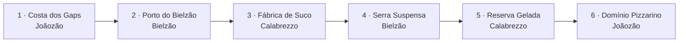

# Super Feka Gaps World — documento de direção

Direção 0.1 · 29 de setembro de 2026 · Com implementação jogável

Esta é a direção de trabalho para a sequência. Uma versão jogável foi implementada após a pré-produção: consulte o [estado da implementação](implementacao.md) e a [galeria de assets](capturas/index.html) para distinguir a entrega atual das metas de refinamento. A referência técnica é o projeto atual e sua [direção visual de produção](../graphics-v2/README.md).

**Estudos visuais:** a [galeria de 13 pranchas de conceito](conceitos/index.html) apresenta os seis mundos, elenco, seis famílias de inimigos, seis confrontos e arquipélago. A [análise de direção e aplicação às fases](conceitos/README.md) orienta a próxima produção de assets; essas imagens ainda não são arte integrada ao runtime.

## Visão

Uma aventura de plataforma cômica em seis ilhas, com caminhos no mapa, segredos e chefes recorrentes. Feka acredita que precisa salvar Yasmin e superar Joãozão. A apresentação celebra suas conquistas como as de um herói; os acontecimentos permitem perceber que ele está se intrometendo no namoro de Yasmin e João. Os gaps são obstáculos físicos, demonstrações da superioridade de João e oportunidades para Feka encontrar caminhos inesperados.

O jogador progride pela habilidade. A graça da história nunca justifica colisões injustas, derrotas obrigatórias durante uma luta vencível ou retirada de uma vitória conquistada.

## O que está estabelecido e o que é proposta

| Estado | Decisão |
| --- | --- |
| Estabelecido pelo autor | Feka é o vilão implícito, convencido de seu papel heroico; Yasmin namora João |
| Estabelecido pelo autor | João Pizzarino / Joãozão é o principal arqui-inimigo; Feka toma gaps dele |
| Estabelecido pelo autor | Tela final: **FEKA SALVOU YASMIN?** |
| Estabelecido pelo autor | André Calabrezzo e Bielzão são amigos/ajudantes de João |
| Estabelecido pelo autor | O mundo industrial se chama exatamente **Fábrica de Suco** |
| Direção solicitada | Cinco fases por mundo, terminando em chefe; revanches com mecânicas próprias |
| Direção solicitada | Arte mais colorida, acabamento de alto nível e falas gravadas combinadas com fala estilizada |
| Proposta de trabalho | Seis mundos, 30 fases: 24 percursos e seis fases de chefe |
| Proposta de trabalho | Calabrezzo é dono da fábrica; Bielzão cuida de cargas, porto e teleféricos |
| Proposta de trabalho | Suco roxo; verde-limão reservado a instrumentos e sinalização |
| Proposta de trabalho | História, nomes das demais regiões, designs e vocalizações detalhados nos documentos abaixo |

As propostas permitem trabalhar de forma coerente enquanto detalhes pessoais dos personagens não são fornecidos. Não são fatos sobre pessoas reais nem novas exigências atribuídas ao autor. Uma futura correção de lore deve se propagar às fichas de fases, encontros e assets correspondentes.

## Escopo da campanha

| Mundo | Fases | Conceito | Confronto |
| --- | --- | --- | --- |
| M1 — Costa dos Gaps | 1-1 a 1-5 | Pontes, falésias, caminhos inferiores | J1 — Joãozão na ponte |
| M2 — Porto do Bielzão | 2-1 a 2-5 | Cargas, elevadores e contrapesos | B1 — Mestre das cargas |
| M3 — Fábrica de Suco | 3-1 a 3-5 | Barris, esteiras e pressão | C1 — Controle de qualidade |
| M4 — Serra Suspensa | 4-1 a 4-5 | Teleféricos, cargas suspensas e verticalidade | B2 — Revanche nas alturas |
| M5 — Reserva Gelada | 5-1 a 5-5 | Estoque refrigerado, gelo e pressão | C2 — Reserva especial |
| M6 — Domínio Pizzarino | 6-1 a 6-5 | Jardins, muralhas e abismos | J2 — O grande gap |

Cada personagem tem dois encontros principais. João também participa de cenas breves ao longo da campanha. O quinto nível de cada mundo contém aproximação curta, checkpoint e chefe; não adiciona uma sexta fase para a arena.

Uma saída secreta na terceira fase de cada mundo abre um caminho para a quinta, permitindo pular a quarta. O caminho comum passa pelas cinco fases. Todos os chefes continuam obrigatórios, e a quarta fase só combina regras já ensinadas. Assim, o escopo prevê a produção de 30 fases, mas uma campanha com todos os atalhos pode terminar após 24 conclusões. Conclusão completa exige as 30 fases, 72 selos e seis saídas secretas.

## Leitura e responsabilidades

| Documento | Conteúdo que define |
| --- | --- |
| [História e personagens](lore.md) | Relações, apresentação, acontecimentos, final e limites do humor |
| [Campanha e 30 fichas](campanha.md) | Percursos, ensino, segredos, checkpoints, assets e critérios de cada fase |
| [Gameplay e progressão](gameplay.md) | Movimento, interações, inimigos, mapa, itens, salvamento e dificuldade |
| [Seis confrontos](chefes.md) | Arenas, ataques, oportunidades, escaladas e condições de recuperação |
| [Direção de arte e áudio](arte-audio.md) | Identidade visual, inventário de assets, animação, efeitos, música e vozes |
| [Produção e critérios de qualidade](producao.md) | Dependências técnicas, protótipos, revisão e entregas verificáveis |

## Limites da versão inicial

- Campanha feita à mão; geração determinística pode variar decoração, nunca o percurso de uma tentativa.
- Movimento principal: andar, correr, pular e sentada. Sem árvore de habilidades ou atributos de força.
- Novas mecânicas organizadas em três famílias: transporte/plataformas; acionadores/contrapesos; barris/pressão.
- Três protagonistas de chefes, seis encontros; nenhum chefe extra necessário para preencher mundos.
- Segredos dentro das fases e conexões no mapa. Sem ilhas adicionais, fases secretas extras ou mundo aberto contínuo neste escopo.
- Mini Fanta e capacete continuam presentes. Suco é um elemento de cenário e combate; não cria uma coleção de transformações do Feka.
- Jogo atual continua sendo a referência de identidade. Migração de engine não é uma etapa prevista.

## O que precisa ser validado em jogo

Os layouts são fichas de design, ainda não matrizes de tiles. Distâncias, velocidades, tempo de antecipação e duração das lutas são hipóteses de protótipo. A primeira cena acabada da fábrica deve validar o novo padrão de arte e interações. Um trecho simples da costa valida a base de movimento. A geometria final e os valores ajustados só são congelados depois de jogar em teclado e toque.

“Qualidade Nintendo” é uma referência de ambição em clareza, resposta e acabamento. Este documento a traduz em critérios observáveis; não declara que a qualidade foi atingida.

## Próxima entrega prevista

Após esta direção, produzir estudos de silhueta dos dois novos personagens e uma cena de referência da Fábrica de Suco, além de testar em formas simples o movimento, o transporte por plataformas e a devolução de barris. A execução e a ordem detalhada estão em [produção](producao.md). Esse primeiro ciclo já resultou na versão descrita em [implementação](implementacao.md); esta seção conserva a ordem de produção planejada.
