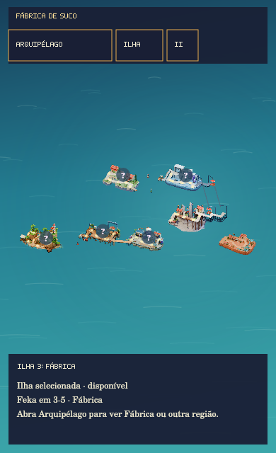
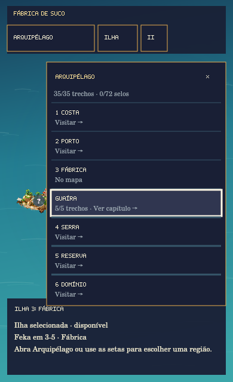

# Compact atlas keyboard fallback

## Reproduced production defect

The full-world atlas proof at 390×640 used the real `WorldMapView` painter but explicitly enabled panorama and supplied synthetic viewport/HUD rectangles. It did not show the DOM header, footer, or region picker. Production `WorldMapView` starts with `overview = false`, measures the full-window `.world-map-scene`, and frames the selected island. Its canvas backing dimensions follow the CSS scene size and capped device pixel ratio. A tiny panorama alone was not evidence that the normal selected-island camera was wrong.

The real defect was input: at a valid compact panorama size, seven shoreline labels cannot fit safely, so `layoutCompactIslandControls` selects the existing Arquipélago fallback. Arrow keys nevertheless targeted its hidden labels and were swallowed without a visible result. The pre-change regression test failed with `Directional input must expose its visible choices`.

## Change

- Compact fallback arrows explicitly open Arquipélago and focus the adjacent visible row. Focus never selects a region, starts a trip, or enters a stage.
- The drawer's arrows/WASD navigate Costa → Porto → Fábrica → Guaíra → Serra → Reserva → Domínio; short drawers scroll the focused row into view. Locked regions remain inspectable.
- Enter/Space keep their native button activation. Repeated activation keydowns are consumed so a held Enter cannot reopen the picker after its initial activation restores focus.
- Escape closes the drawer and returns focus to Arquipélago. A further Escape leaves panorama. Resize-induced fallback returns an obscured sign's focus to the visible Arquipélago trigger without automatically opening the drawer.
- The fallback hint describes both the existing touch/click entry and directional navigation.

Camera code, world placement, route geometry, saves, IDs, Guaíra assets and campaign gates are unchanged. This adds no separate Guaíra shortcut and no Factory–Serra bridge.

## Native before/after evidence




These are actual production `WorldMapView` Canvas pixels and `WorldMapHud` bitmap surfaces, with the real key handlers and actual public assets. The DOM UI is composited offline from production text/visibility/focus using declared CSS layout fixtures. This is **not browser, real DOM-layout, or device QA**. No browser launch was attempted.

The [before](before-report.json) and [after](after-report.json) reports record identical 390×640 cameras: zoom `0.1890900094671359`, center `(2.3187241250000006, 0.1856708698602893)`. Both start outside overview and make zero selection/entry callbacks. After one ArrowRight, the drawer changes from closed to open with Guaíra focused.

The 640×360 control case already fits its terrain labels. Its before/after native composite is byte-identical, SHA-256 `7ca64bb0cd107e5c51c4cd90408cd70872f8e23b71cc7f8398f713796c6280ee`.

Reproduce with an available `@napi-rs/canvas` installation (optional module override):

```sh
CANVAS_MODULE=/absolute/path/to/@napi-rs/canvas/index.js \
  node --import tsx tools/prove_compact_atlas_navigation.mts /tmp/compact-atlas-native .
node --import tsx --test tests/world-map-hud.test.ts tests/world-map-integration.test.ts
node node_modules/typescript/bin/tsc -p tsconfig.json --noEmit
node node_modules/typescript/bin/tsc -p tsconfig.tools.json --noEmit
```

## Verification boundary

The focused HUD/integration/control/camera matrix passes 222/222 tests; both TypeScript projects pass. These tests cover all seven rows, explicit touch/click activation, Enter/Space ownership, held/released keys, arrow boundaries/modifiers, close/Escape focus, resizing, and motion/reduced-motion input isolation. The scene's measured canvas sizing is exercised by the integration harness; no device/browser claim is made.

The aggregate test attempt was not green: 1787/1795 passed, with two failures in `guaira-completed-avatar.test.ts` and six in `guaira-map-ui.test.ts`. A separate clean, detached worktree at the exact untouched base `eca0d15cda0b53b60d19b40126c0751307bdfdd1` reproduced all eight failures in those two files (11/19 passed). The failures therefore predate this compact-navigation patch. Build and validators did not run after that failure; integration owns the combined checks. The ordinary `tsx` CLI initially failed to open its local IPC pipe (`EPERM`), so the test attempt used Node's `--import tsx` entry point without starting a listener.

## Integration on the final Guaíra model

The compact patch was cleanly applied after model commit
`b396534cb2e3c80e8a699a5ccd74bdb85db8cd51`, preserving its exact runtime assets,
water corrections, arrival fixtures, camera and geography. The preceding
before/after images document the original isolated patch; the combined tree
was also checked with the same native production-painter harness at 390×640
and 640×360. Its camera, fallback behavior and zero selection/entry callbacks
match the reports above.

On that integrated tree, all **225 tests across six focused HUD, integration,
control, framing and camera files pass**, as do both TypeScript projects,
level/player/world validators, production build and build-size check.
Production output is **43,566,163 bytes**, within the 45,000,000-byte budget.
The old aggregate failure described above occurred before the model release's
fixture corrections; the unrelated full suite was not rerun for this patch.
No browser/device QA, aircraft-clearance change, Oracle action or Vercel
publication is part of this integration.
