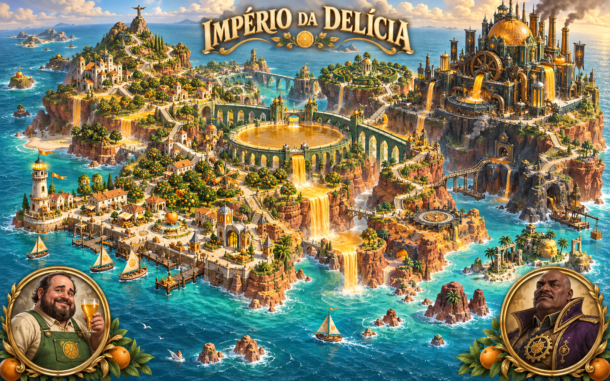

# Império da Delícia

A [revisão da interface](interface-v4.md) alinha a expansão à fonte bitmap, à paleta e aos menus do World, com mapa em tela cheia e textos mais curtos.

**Modelo atual: [polimento do terreno, cachoeiras e praias, revisão 4](modelo-v4.md).** A revisão atual refina o rio de suco, os afloramentos calcários, as enseadas e o encontro da ilha com o mar sobre a [arquitetura da revisão 3](modelo-v3.md). A [segunda produção da campanha](entrega-v2.md) descreve os 48 setores, os seis assets imagegen, oito inimigos, movimentos dos bosses, máquinas e medalhas. O texto abaixo preserva a direção e as especificações da primeira entrega.

Expansão jogável de **Super Feka Gaps World**, produzida em 4 de outubro de 2026.
Uma ilha de pomares, aquedutos, arquivos de memória e refinarias de suco de laranja,
com Paulo Guina como grande vilão e Jailson Mendes, o Jajá, como guardião intermediário.
Os personagens, suas relações e os acontecimentos desta aventura são ficção cômica.



## Entrar na ilha

Com o servidor Vite ativo, abra **`/delicia.html`** ou **`/?delicia=true`**.
No mapa do World, o acesso **“Império da Delícia”** abre a campanha.
O botão **“Ver panorama”** mostra a ilha junto ao arquipélago existente.
O progresso da expansão é independente, em `super_feka_delicia_v1`.

```sh
npm run dev
npm run check
npm run size:build
```

O endereço online do jogo permanece uma publicação separada. Este trabalho entrega
código, assets, arquivos editáveis e build local. A expansão mantém plataforma 2D;
o mapa usa um diorama construído em Blender e renderizado em 3D.

| Ação | Teclado |
| --- | --- |
| Mover | A/D ou ←/→ |
| Pular; soltar para salto curto | Espaço, W, Z ou ↑ |
| Impulso cítrico | Shift ou X |
| Sentada no ar | S ou ↓ |
| Lançar sementes | J |
| Rebater no momento certo | Q |
| Abrir uma válvula próxima | E |
| Pausar / voltar | Esc |
| Som | M ou botão Som |

Celulares têm oito botões de toque, com suporte a comandos simultâneos. As opções
oferecem volume separado, redução de tremor e efeitos, seis corações e avisos mais
longos na **Travessia tranquila**. O desafio padrão tem quatro corações.

A redução de movimento acompanha a preferência do sistema, inclusive quando ela
muda durante o jogo. **Sempre reduzir movimento** mantém a redução ligada só neste
jogo; desmarcar volta a seguir o sistema. Isso não muda a física nem os avisos de perigo.

## A história

Antes da fábrica, a Delícia era uma tradição: cada família plantava uma árvore
para outra família e oferecia o primeiro copo a quem chegasse. Guina e Jajá
construíram juntos um aqueduto que tornou a partilha possível nos bairros altos.
A ilha não nasceu de um rei; nasceu de uma mesa que nunca ficava fechada.

Uma tempestade destruiu a safra do norte. Guina salvou a colheita restante com uma
prensa de emergência, mas nunca abandonou o medo daquele inverno. Passou a medir
segurança pelo tamanho de sua reserva. Jajá prometeu guardar a fonte até haver
suco para todos; Guina alterou o medidor para contar somente os barris da cidadela.
A promessa do amigo virou uma fechadura que nunca teria motivo para abrir.

O suco da nascente conserva memórias de quem o compartilhou. O filtro industrial
separa essas lembranças, transforma sementes em munição e deixa a polpa ganhar
vida nos corredores. A reserva perfeita de Guina perde o gosto. Dona Casca
manda uma carta a Feka: traga um copo vazio e ajude a ilha a lembrar por quê existe.

Feka atravessa os bairros, devolve o fluxo às fontes e demonstra a Jajá que
proteger uma promessa exige escutar as pessoas. Depois do confronto, o guardião
abre o rio e ajuda Feka a subir à cidadela. Guina mistura orgulho, medo de perder
o controle e uma paixão teatral pelo visitante: pede namoro e ameaça deixá-lo
oco, abrindo literalmente gaps no chão. Feka responde por si e continua a missão.

No final, a derrota não apaga o passado. Guina devolve a safra, Jajá repara as
fontes, e cada bairro decide o que precisa reconstruir. Um convite para tomar
suco depende da escolha de Feka. O tesouro deixa de ser uma reserva central e
volta a existir nas pequenas mesas da ilha.

O **Caderno da Partilha** reúne vinte registros: cartas, contratos, mosaicos,
plantas, receitas e ecos. Memórias são adquiridas em percurso e nos desfechos;
todas podem ser obtidas. Os selos são desafios de exploração e não bloqueiam a
história. Conteúdo e diálogos completos: `src/adventure/delicia/DeliciaContent.ts`.

## Percursos

| # | Destino | Variação principal |
| --- | --- | --- |
| 1 | Cais do Primeiro Gole | Introdução a saltos, sementes, fontes e registros |
| 2 | Pomares da Partilha | Molas cítricas, inimigos aéreos e trilhas superiores |
| 3 | Aqueduto dos Ecos | Válvulas em sequência; descoberta das raízes |
| 4 | Cascatas de Âmbar | Balsas móveis, quedas de suco e jatos com aviso |
| 5 | Arquivo Fermentado | Barris impostores e plataformas frágeis |
| 6 | Jajá, Guardião da Nascente | Caneca, ondas, investidas e ressaca cítrica |
| 7 | Maré de Laranja | Travessias longas, impulso e correntes móveis |
| 8 | Engrenagens da Polpa | Esteiras, sentinelas e lançadores de suco |
| 9 | O Jardim Proibido | Copas, abelhas, molas e desvio para o sino |
| 10 | Caldeira do Último Copo | Descargas periódicas e fontes em sequência |
| 11 | A Escadaria da Reserva | Combinação de movimento, impulso, prensas e válvulas |
| 12 | Paulo Guina, Barão da Delícia | Gaps, corações, investidas, prensas e pressão máxima |

**Santuário das Raízes** e **Sino da Última Safra** são dois percursos opcionais
liberados após as fases 3 e 9. Há 36 selos no conjunto de percursos principais e
opcionais. As fases de travessia têm duas fontes para abrir, caminhos altos,
memórias, laranjas, corações e três checkpoints. A saída exige as fontes abertas;
nas arenas, exige a derrota do chefe.

Sete famílias de inimigos dão respostas diferentes: polpa ambulante, besouro da
safra, vespa cítrica, rolete, sentinela blindado, engarrafador e barril impostor.
O rolete avisa antes de acelerar; o engarrafador prepara o lançamento; o sentinela
precisa ser atordoado ou receber uma sentada; o impostor desperta de perto.

## Os chefes e os gaps

Os dois encontros têm três fases de vida. A sequência é **preparação → aviso →
ataque → recuperação**. Sementes e sentadas só causam dano quando a defesa abre;
a sentada vale dois pontos. As plataformas laterais permitem alcançar fisicamente
a cabeça, e uma válvula libera pressão por um intervalo limitado.

Jajá tem doze pontos de vida. A caneca marca a área de queda e lança arcos de suco
para o alvo fixado no aviso. Ondas atravessam o piso, investidas ocupam o corredor
e a ressaca combina múltiplas ondas. Na terceira fase, os avisos ficam menores e
a sequência mistura os padrões aprendidos.

Guina tem vinte e quatro pontos de vida. A pressão acumulada sustenta a armadura;
abrir uma válvula ou devolver projéteis enfraquece esse sistema. Corações podem
ser rebatidos com Q, enquanto sementes e sentadas aproveitam o resfriamento.
Prensas atacam colunas marcadas, e a reserva máxima mistura descarga vertical e
uma chuva de projéteis. Os alvos não perseguem Feka depois do aviso.

O ataque **“Vou te deixar oco”** marca uma região dourada e remove sua colisão
por 4,3 segundos. O gap tem largura de 180 unidades e preserva os dois extremos
das válvulas. É possível sair da marca, saltar ou usar o impulso. Cair custa
vida e retorna Feka ao último ponto seguro: **“Feka tomou um gap!”**. Buracos de
terreno nas fases usam a mesma consequência. Aviso, forma, texto e efeito sonoro
comunicam o perigo; a informação não depende somente de cor.

Movimento usa passo fixo de 120 Hz, tolerância de salto depois da borda,
armazenamento breve de comando antes de pousar, altura variável, plataformas
móveis que carregam o jogador e impulso com imunidade breve. A câmera acompanha
com suavização. Animação combina os sprites originais de Feka com poses geradas
dos chefes, antecipação, inclinação, respiração, impacto, partículas e tremor
opcional. Os chefes não têm modelos humanoides 3D: usam um atlas de poses 2D.

## Identidade visual e modelo

Creme de arenito, verde das copas, azul-petróleo, latão, âmbar e roxo imperial
unificam a ilha. A vila e os pomares são claros; o reservatório tem luz atravessando
os arcos; o arquivo guarda cristais e barris; a cidadela transforma a mesma
arquitetura em uma máquina de controle. O atlas de ambientes contém quatro
cenários próprios, além da paisagem aberta de pomar e aqueduto.

O diorama tem **40,6 metros de largura de terreno**, 1.472 objetos e vinte materiais.
Inclui vila, píeres, farol, fontes, pomares, estratos de costa, aqueduto,
reservatório, canais de suco, refinaria, chaminés, escadarias e cidadela com cúpula
cítrica. Sua posição é fixa no atlas: `left=-2.34`, `top=-2.72`, largura e altura
`2.25`. Os canvases das ilhas antigas têm escala `1`; a expansão ocupa 2,25 vezes
a extensão nominal em cada eixo, aproximadamente 5,06 vezes a área do canvas.
Essa escala permanece constante quando a câmera muda de destino.

Os doze marcadores foram projetados da câmera Blender para o mapa. Fontes:

- `imperio-delicia.blend`: cena editável, câmera, luzes e materiais.
- `imperio-delicia.glb`: geometria exportada em glTF binário.
- `island-render.png`: render mestre transparente.
- `image-generation.json`: prompts completos, modos e referência do atlas de poses.
- `runtime-manifest.json`: fontes, dimensões, tamanhos e hashes dos derivados.

São seis gerações de imagem: capa, paisagem, retratos, props, poses de chefes e
ambientes. O sétimo arquivo visual de runtime é o render Blender. Os PNG originais
continuam preservados; o navegador recebe WebP. Nenhuma fotografia externa foi
incorporada aos assets.

## Áudio e pesquisa

ElevenLabs produziu três trilhas instrumentais originais de sessenta segundos,
nove efeitos, um ambiente de pomar e sete falas brasileiras. A voz é uma
interpretação de biblioteca, **Will — Deep Smooth and Affectionate**, e não uma
clonagem dos atores. A seleção sonora usa marimba, flauta, cavaquinho, percussão,
latão e textura de suco; a fala reduz temporariamente o volume da música.

Os vinte MP3 mestres ficam em `audio/`; derivados Opus de 80 kb/s VBR ficam em
`public/assets/delicia/audio/`. Pausa suspende o contexto de áudio, troca de música
usa transição de volume e mute atua na saída comum. Falha de dispositivo ou áudio
não impede a fase. Não foram incorporadas músicas comerciais baixadas da internet.

Referências consultadas para identificar o bordão, o suco e a associação entre
Jailson e Paulo Guina: [Jailson Mendes](https://en.wikipedia.org/wiki/Jailson_Mendes)
e [perfil no O Estado](https://oestadoce.com.br/arte-agenda/ai-que-delicia-como-jailson-mendes-foi-de-ator-porno-vida-de-youtuber/).
Essas referências inspiram a homenagem; contratos, ilha, conflitos e romance são
invenções deste jogo. Documentação técnica: [efeitos ElevenLabs](https://elevenlabs.io/docs/api-reference/text-to-sound-effects/convert)
e [música ElevenLabs](https://elevenlabs.io/docs/api-reference/music/compose).
Prompts e créditos específicos estão em `audio-manifest.json` e `voice-manifest.json`.

A chave foi lida do arquivo fornecido, somente durante geração. Os programas
recebem `--key-file`; a chave não é gravada em assets, manifests ou bundles.
Arquivos já gerados são reutilizados. O empacotador não chama APIs.

## Reproduzir e verificar

```sh
blender -b --python tools/delicia/build_island.py
python tools/delicia/package_assets.py
npm run check
npm run size:build
```

Geração de áudio nova, somente quando necessária:

```sh
python tools/delicia/generate_audio.py --key-file CAMINHO_PRIVADO
python tools/delicia/generate_voices.py --key-file CAMINHO_PRIVADO
```

`package_assets.py` exige Pillow e ffmpeg. O script de ilha cria uma cena em um
processo Blender de background; não opera uma cena aberta pelo usuário.

`tests/delicia-campaign.test.ts` verifica conteúdo, progresso, importação, retomada,
recordes, avisos, superfícies móveis, travessia física sem teleporte, integridade
de assets, combate completo dos dois chefes e alcance real da sentada. A auditoria
de terreno remove inimigos para isolar geometria; o teste de combate usa os
ataques, projéteis, dano, válvulas e spawn reais, sem reduzir artificialmente a vida.

`scripts/verify_delicia.cjs` verifica controles nativos, teclado, pausa, queda real,
persistência, os vinte arquivos de áudio, mute, entrada alternativa, integração ao
panorama e toque móvel. Requer Playwright e Chromium já disponíveis, configurados
por `PLAYWRIGHT_LIB` e `CHROMIUM_PATH`. Usa perfis isolados e registra os casos em
que uma posição foi arranjada, distinguindo-os de entrada real.

Capturas e relatório ficam em `output/delicia/`. Resultados de regressão e tamanho
do build ficam documentados no [relatório de entrega](entrega.md). Os testes automatizados não
substituem um playtest humano prolongado ou uma comparação auditiva entre codecs;
a qualidade comercial de uma produção de estúdio não é certificada por eles.
