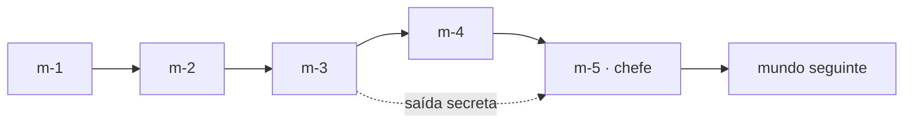

# Gameplay e progressão

> Registro da direção de pré-produção. A execução posterior e seus limites estão em [implementação](implementacao.md).

[Voltar à direção](README.md)

## Movimento e câmera

Preservar como ponto de partida o movimento a 60 Hz, aceleração, salto variável, coyote time, jump buffer e sentada do projeto atual. Não fixar o alcance dos saltos por estimativa: medir trajetórias no protótipo com e sem corrida antes de desenhar as matrizes finais.

- Nenhum botão de ação adicional é necessário: sentada aciona mecanismos; pular atravessa; andar/correr posiciona.
- Saltos obrigatórios iniciais usam margem ampla em relação ao alcance medido. Saltos de limite pertencem aos caminhos opcionais.
- Rotas obrigatórias são possíveis sem capacete ou Mini Fanta. Itens ajudam; sua ausência não bloqueia o progresso.
- Inércia no gelo é ensinada sobre piso seguro, com recuperação. Saída do gelo devolve o comportamento normal de forma consistente.
- Câmera antecipa a direção do percurso sem deslocamentos que escondam a aterrissagem. Em trechos verticais, mostrar o próximo apoio antes de exigir o salto.
- Arenas usam enquadramentos próprios sem diminuir Feka até perder legibilidade. A câmera não esconde um ataque ativo.
- Tremor e efeitos não alteram hitboxes; opções de reduzir tremor e flashes entram no acabamento.

## Contratos das mecânicas

Valores temporais abaixo são pontos de partida para protótipo, não valores implementados ou aprovados por teste.

| Família | Regra | Ensino e recuperação |
| --- | --- | --- |
| Plataforma móvel | Percurso e paradas previsíveis; transporta Feka também quando parada/retomada | Primeira travessia sobre chão; pontos de espera; sem esmagamento no primeiro contato |
| Elevador/contrapeso | Sentada num acionador altera entre duas posições estáveis | Símbolo igual no acionador e na carga; pode reativar; nunca fica permanentemente inacessível |
| Carga pendular | Movimento cinemático definido, com extremos e ritmo visíveis | Primeira carga não causa dano; uso posterior como apoio ou obstáculo claramente distinto |
| Esteira | Adiciona transporte horizontal ao personagem e aos barris | Laterais e setas indicam direção; uma área normal antes da borda permite recuperar controle |
| Acionador de sentada | Só dispara no impacto; feedback visual e sonoro confirma uma única ativação | Mesma linguagem em todos os mundos; nova ativação só após liberar e repetir o golpe |
| Barril comum | Rola, rebate nos dispositivos previstos e quebra em paredes de contenção | Topo causa dano por padrão; não pode ser carregado, surfado ou pisado como inimigo |
| Barril pressurizado | Tem cinta, válvula e preparação própria; interação só por mecanismos | Não introduz regra baseada exclusivamente na cor; trajetória não muda sem aviso |
| Jato de pressão | Aviso, atividade e descanso; origem fixa e marcada | Manômetro + tremor + som; primeiro jato visto de posição segura; testar aviso inicial de 700–1000 ms |
| Superfície congelada | Atrito reduzido; textura e brilho próprios | Travessia inicial larga; piso de freio depois; nenhum salto obrigatório depende de um item |
| Gap de João | Marca a região antes do impacto; alvo fica fixo ao terminar a marcação | Primeiro golpe usa aviso de referência de 700 ms; jogador consegue escapar após reconhecer o sinal |

Plataformas de apoio, cargas perigosas e decoração suspensa têm silhuetas distintas. Um mesmo sprite não alterna silenciosamente entre sólido e atravessável. Simular cargas por trajetórias e estados definidos evita depender de uma nova física genérica de cordas.

### Pressão, suco e reversibilidade

O suco exposto nos tanques abertos e jatos ativos é perigoso. Suco atrás de vidro é decoração. Não há natação nem transformação ao tocá-lo. Vidro, borda da cuba, animação e ícone de perigo reforçam a diferença.

Uma válvula/acionador muda uma condição local e reversível. Cor verde de um indicador não garante segurança sozinha: seta, posição mecânica e estado da animação também mudam. Toda combinação acionável deve permitir alcançar novamente o comando, completar o trecho ou reiniciar no checkpoint sem perder progresso permanente.

## Elenco de inimigos comuns

Seis famílias de comportamento no total, incluindo o minion atual. Variações de figurino reutilizam a regra da família; uma mudança de defesa exige marca visual nova e apresentação segura.

| ID de design | Família | Comportamento e resposta | Introdução / reutilização |
| --- | --- | --- | --- |
| E1 | Minion | Patrulha; pulo ou sentada o derrota | 1-1; todos os mundos com figurino local |
| E2 | Operário de capacete | Anda devagar; pulo comum rebate sem dano de contato superior, sentada quebra a proteção | 2-2; fábrica e domínio |
| E3 | Carregador | Fica ancorado, mostra o barril, lança e espera; vulnerável por cima | 3-1; reserva |
| E4 | Maromba de investida | Marca a direção e corre até área de parada; fica vulnerável após o esforço | 2-4; serra e domínio |
| E5 | Agitador mecânico | Varredura periódica; atravessar no descanso, mecanismo invulnerável | 3-2; reserva |
| E6 | Vigia do teleférico | Percorre trilho visível em velocidade regular; pulo só com topo livre | 4-1; domínio |

E2 nunca exige descobrir sua imunidade morrendo; o primeiro aparece sozinho em espaço largo. E4 tem preparação de referência de 650–900 ms. E6 é uma máquina com cabo visível, evitando apresentar um novo sistema de voo livre.

E4 aparece pela primeira vez numa fase que pode ser pulada por atalho. Sua primeira aparição posterior em 4-2 repete uma apresentação segura; chefes nunca dependem de uma regra ensinada apenas numa quarta fase.

## Itens, dano e repetição

- **Capacete:** absorve um golpe, seguindo a base atual. Reposição disponível em pontos pensados de aproximação; nunca nasce diretamente sobre o jogador.
- **Mini Fanta:** preservar o efeito atual como referência; medir e documentar seu efeito real antes de alterar. Não atribuir novos poderes à lata por conveniência de uma fase.
- **Moedas:** recompensa de percurso e pontuação. Com as mudanças de vidas abaixo, deixam de conceder vidas nesta campanha; a regra atual permanece no jogo original.
- **Selos de aventura:** nome provisório para três coletáveis únicos em cada fase de percurso. Total: 24 × 3 = **72**. Um na rota visível, um em exploração e um em desafio opcional. Chefes não têm selos escondidos durante a luta.
- **Dano:** capacete protege; sem proteção, manter morte em um golpe como hipótese inicial. Testar sua severidade com novos jogadores antes de congelar a regra.
- **Tentativas:** proposta de tentativas ilimitadas na campanha World. Morrer retorna ao checkpoint; não reinicia mundos nem impõe uma reserva de vidas. O jogo original mantém suas próprias regras.
- **Tempo:** campanha de exploração sem cronômetro fatal. Tempo decorrido continua disponível no resultado; desafios de tempo não são exigidos para terminar.
- **Repetição:** chegada ao checkpoint deve preceder cada sequência longa nova; alvo de revisão: evitar repetir mais de aproximadamente 45–60 segundos de percurso já dominado.

As regras de vidas e cronômetro são decisões propostas para acomodar exploração, não comportamentos já existentes.

## Mapa e saídas

Mapa em duas escalas: arquipélago e trilha local da ilha. A navegação só mostra escolhas alcançáveis; concluir uma fase anima a nova conexão, salva progresso e devolve o controle ao mapa.

Para cada mundo `m`:

- Saída normal em `m-3` abre `m-4`. Saída secreta em `m-3` abre tanto `m-4` quanto a conexão direta a `m-5`.
- As duas saídas concluem a fase. O registro de saída secreta permanece separado da conclusão.
- `m-5` só abre por conclusão de `m-4` ou descoberta da saída secreta de `m-3`; vencer o chefe abre o próximo mundo.
- Saídas secretas só existem em `1-3`, `2-3`, `3-3`, `4-3`, `5-3`, `6-3`: seis no total.
- A quarta fase permanece acessível depois do atalho e oferece seus três selos. O mapa distingue “acessível” de “concluída”.
- Selos não abrem o caminho obrigatório. Desbloqueiam páginas de galeria por mundo ao reunir os 12 correspondentes; não concedem vantagem de combate.
- Viagem entre mundos já abertos é livre no mapa. Não exigir refazer uma fase para voltar.
- Vitória final: concluir J2. Conclusão completa: 30 fases + 72 selos + seis saídas secretas. O título do final é igual nas duas situações.

## Salvamento e checkpoints

Salvar com chave e versão próprias da campanha World. Nunca interpretar recordes do jogo atual como progresso da sequência.

**Persistente:** versões de dados, IDs de fases concluídas, selos por ID único, saídas secretas, cenas vistas, posição no mapa e configurações. Conexões liberadas são derivadas dessas conquistas para evitar estados contraditórios.

**Retomada de fase:** ID da fase e do último checkpoint. Recarregar o navegador reconstrói um estado canônico daquele checkpoint, com mecanismos e inimigos restaurados; não serializa uma simulação inteira no meio de um golpe. Se a versão do conteúdo tornou o checkpoint inválido, retornar com segurança ao início da fase e conservar conquistas.

**Coletas:** selos e saídas secretas são gravados assim que confirmados e não são perdidos ao morrer. Moedas comuns e pontuação da tentativa são transitórias. Uma recompensa única não soma novamente ao repetir o trecho.

**Chefe:** checkpoint fora da arena; morrer ou recarregar reinicia a luta inteira, com vida, arena e comandos restaurados. Equipamento inicial de tentativa é definido pelo checkpoint, evitando perder proteção a cada retry até ficar em desvantagem permanente.

**Falha de armazenamento:** conservar progresso em memória e informar que ele não será mantido ao fechar. Validar versão e conteúdo carregado; não sobrescrever silenciosamente um save desconhecido. Exportar/importar save é desejável para lançamento, depois da base local funcionar.

## Pontuação e placar

A campanha permite repetição, atalhos e progresso salvo; o placar atual de uma corrida linear não pode receber esses resultados como se fossem equivalentes. Para a primeira versão World, mostrar estatísticas locais de conclusão, selos e tempo por fase. Um placar online específico só entra após definir categoria, regras e validação; ele não é dependência da campanha.

## Contrato de justiça

- Nenhum ataque perigoso chega de fora da câmera sem anúncio identificável.
- Nenhuma saída secreta depende de salto cego, bloco invisível obrigatório ou consulta externa.
- Pistas de caminho inferior mostram uma borda, trilha ou plataforma antes de pedir a queda.
- Colisão considera o movimento relativo de plataformas e cargas; não atravessar apoios ao mover ou esmagar contra tetos sem regra explícita.
- Aviso de chefe, som e hitbox se referem à mesma área e ao mesmo instante.
- Fases continuam vencíveis após desperdiçar itens, errar acionadores ou seguir o caminho inferior.
- Cenas já vistas, menus e retornos não alongam artificialmente cada nova tentativa.
